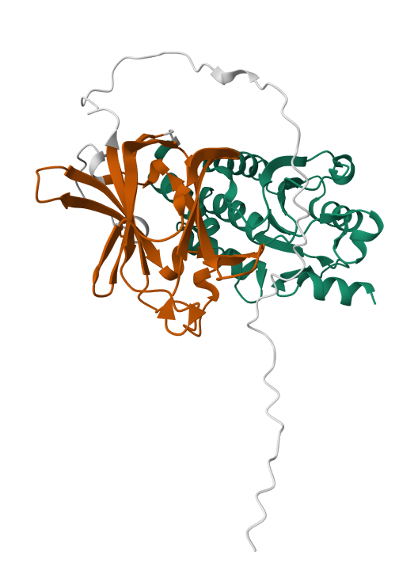
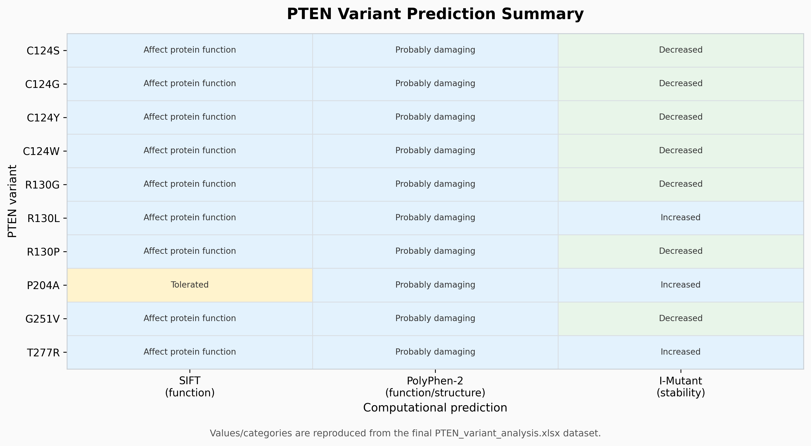

# PTEN Variant Analysis

## Overview

This project presents an **in silico analysis of selected human PTEN variants** to investigate their potential functional, structural, stability-related, and clinical significance.

Ten amino-acid substitutions in the human PTEN protein were analysed using multiple computational prediction tools and publicly available clinical resources.

## Variants Analysed

| Variant | Position |
|---|---:|
| C124S | 124 |
| C124G | 124 |
| C124Y | 124 |
| C124W | 124 |
| R130G | 130 |
| R130L | 130 |
| R130P | 130 |
| P204A | 204 |
| G251V | 251 |
| T277R | 277 |

## Computational Workflow

The selected variants were investigated using:

- **SIFT** — prediction of potential effects on protein function
- **PolyPhen-2** — prediction of potential functional and structural effects
- **I-Mutant 2.0** — prediction of changes in protein stability
- **Project HOPE** — structural and physicochemical interpretation of amino-acid substitutions
- **ClinVar** — clinical variant annotation

The results from these resources were integrated to provide a comparative assessment of the selected PTEN variants.

## PTEN Protein Structure

### PTEN Domain Structure



### Three-Dimensional Structure


## Variant Prediction Summary



## Key Findings

- PolyPhen-2 predicted all ten selected variants as **probably damaging**.
- SIFT predicted nine variants to **affect protein function**.
- I-Mutant predicted **decreased stability for seven variants** and **increased stability for three variants**.
- **C124G** and **G251V** showed the largest predicted decreases in protein stability.
- Several selected variants affect highly conserved residues within the PTEN phosphatase domain.
- The combined computational evidence indicates an overall damaging pattern across the selected variant panel.
- Stability predictions alone were not sufficient to determine functional impact, highlighting the importance of integrating multiple computational and clinical sources.

## Repository Structure

```text
PTEN-Variant-Analysis/
│
├── .gitignore
├── README.md
│
├── data/
│   ├── PTEN_variant_analysis.csv
│   └── PTEN_variant_analysis.xlsx
│
├── docs/
│   ├── METHODOLOGY.md
│   └── RESULTS.md
│
└── figures/
    ├── PTEN_domain_structure.png
    ├── PTEN_3D_structure.png
    └── variant_prediction_summary.png
